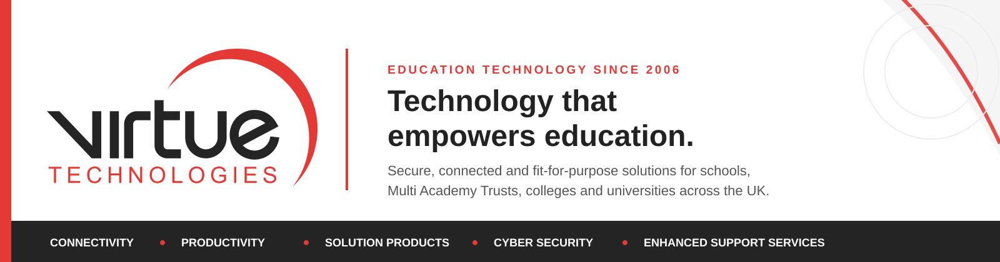

 

[**Website**](https://www.virtuetechnologies.co.uk/) &nbsp;•&nbsp;
[**Solutions**](https://www.virtuetechnologies.co.uk/solutions/) &nbsp;•&nbsp;
[**News & Insights**](https://www.virtuetechnologies.co.uk/news-updates/) &nbsp;•&nbsp;
[**LinkedIn**](https://www.linkedin.com/company/virtue-technologies-limited/) &nbsp;•&nbsp;
[**Contact**](https://www.virtuetechnologies.co.uk/contact/)

---

## Your ICT partner for bespoke solutions in education

Virtue Technologies is an education-focused IT company working collaboratively with schools to deliver secure, connected and fit-for-purpose technology solutions.

Founded in 2006, we support Primary and Secondary Schools, Multi Academy Trusts, Further Education Colleges and Universities across the UK. We combine dedicated technical expertise, in-house service specialists and long-term partnership to help education organisations improve teaching, learning and day-to-day operations through technology.

<table>
<tr>
<td width="33%" valign="top">

### Connectivity Platforms

Internet, wireless and network services designed for resilient, secure education environments.

</td>
<td width="33%" valign="top">

### Productivity Tools

Microsoft 365, devices, software licensing, audio visual, digital signage and visitor management.

</td>
<td width="33%" valign="top">

### Solution Products

Cloud backup, disaster recovery, hosted services, infrastructure, storage and virtualisation.

</td>
</tr>
<tr>
<td width="50%" valign="top" colspan="1">

### Cyber Security

Practical protection, assessment, monitoring and response built around the needs of education.

</td>
<td width="50%" valign="top" colspan="2">

### Enhanced Support Services

Installation, support, training and specialist services shaped around individual schools and Trusts.

</td>
</tr>
</table>

---

## What makes us tick

<table>
<tr>
<td width="20%" align="center" valign="top"><strong>Relationships</strong> Understanding needs and delivering the best outcomes together.</td>
<td width="20%" align="center" valign="top"><strong>Trust</strong> Transparent, open communication at the centre of everything we do.</td>
<td width="20%" align="center" valign="top"><strong>Opportunities</strong> Creating meaningful opportunities for people and organisations to grow.</td>
<td width="20%" align="center" valign="top"><strong>Ownership</strong> Embracing challenges and seeing positive outcomes through.</td>
<td width="20%" align="center" valign="top"><strong>Positive Change</strong> Helping schools make changes that have a genuine impact on learning.</td>
</tr>
</table>

---

## Engineering at Virtue

This GitHub organisation is home to software, automation, integrations and operational tooling developed by Virtue Technologies.

Our engineering work is guided by a few clear principles:

- **Secure by design** - protecting customer data, identities and tenant boundaries from the outset
- **Useful in the real world** - solving genuine operational problems for education and technical teams
- **Reliable in production** - observable, maintainable and designed for long-term service
- **Clear and accountable** - documented decisions, controlled change and visible outcomes
- **Built for education** - shaped around the realities of schools, colleges and Multi Academy Trusts

Many repositories support customer environments, managed services and commercial platforms, so they remain private by design. Public resources will appear here where they offer genuine value to the wider education and technology communities.

---

### Working towards the best education outcomes, together.

[**Find out how Virtue Technologies can help →**](https://www.virtuetechnologies.co.uk/contact/)

 

Virtue Technologies Limited · Education technology specialists since 2006

